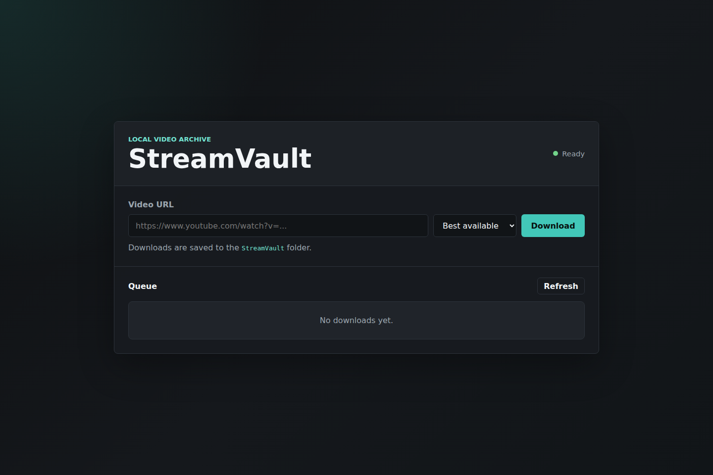
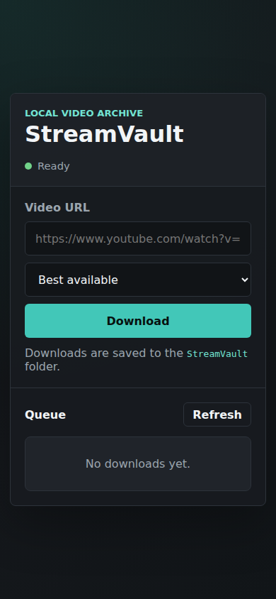

# StreamVault

StreamVault is a small local web app for saving online videos through a packaged
`yt-dlp` binary. It keeps the UI clean, uses best available quality by default,
and leaves the actual download engine to proven tools instead of reimplementing
video extraction.

## Preview



<p align="center">
  
</p>

## Features

- Clean browser UI with progress updates.
- Best available quality by default via `yt-dlp` format selector `bv*+ba/b`.
- Optional maximum quality presets.
- Local-only download queue.
- Bundled `yt-dlp` and FFmpeg binaries through npm dependencies.
- Health check for the packaged downloader tools.
- Focused tests for URL validation, quality selection, command construction, and API validation.

## Requirements

- Node.js 20 or newer.

No separate `yt-dlp` or FFmpeg install is needed. They are installed with the app
dependencies.

## Run

```bash
npm install
npm start
```

Open `http://localhost:4137`.

Downloaded files are written to `downloads/`.

## Desktop App

StreamVault can also be packaged as a desktop app for Windows, macOS, and Linux.

```bash
npm run build:win
npm run build:mac
npm run build:linux
```

Packaged installers are written to `release/`. The desktop app starts the local
API internally and saves files to the user's `Downloads/StreamVault` folder.

GitHub Actions builds all three platforms and uploads the installers as workflow
artifacts.

## Test

```bash
npm test
npm run screenshot
```

The tests do not call YouTube. They verify the downloader uses the best-quality
format selector by default and that the API rejects invalid input before a job is
created.

The screenshot script opens the UI at desktop and mobile viewport sizes, checks
that the core controls are visible and contained in the viewport, and saves
screenshots under `screenshots/`.

## Notes

Only download media that you have the right to save. Availability, formats, and
site support are handled by `yt-dlp`, so keeping that tool up to date is the best
way to keep StreamVault working.
